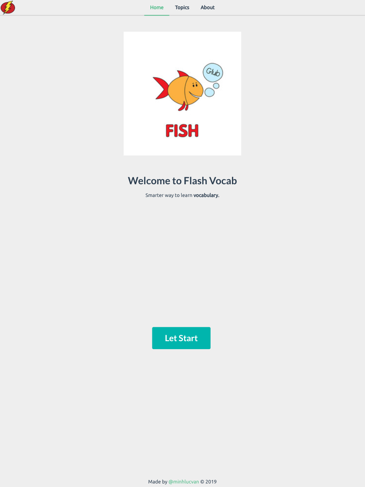
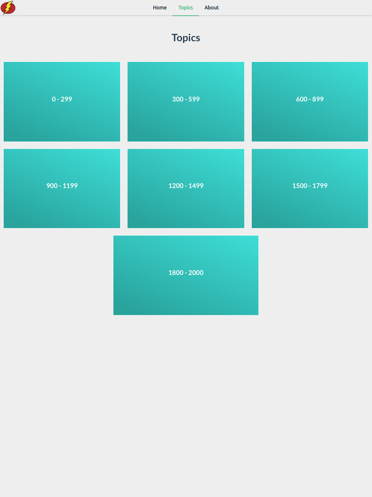
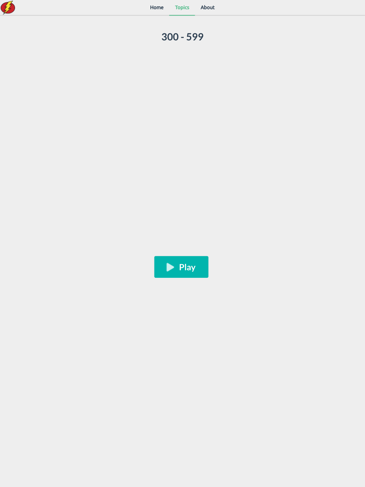
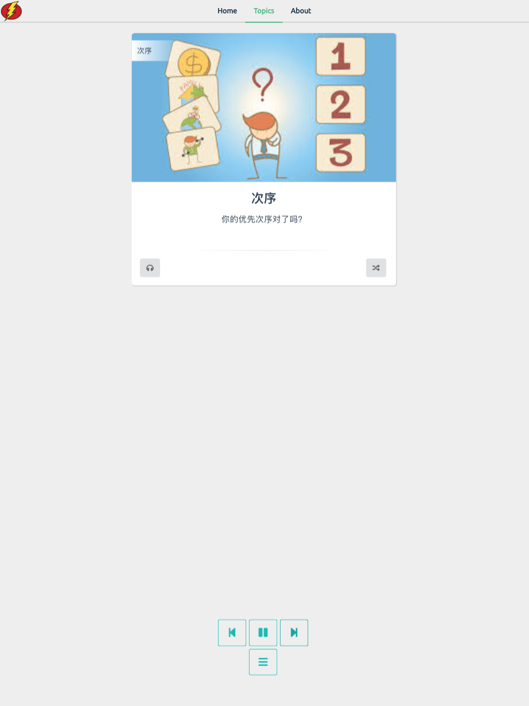
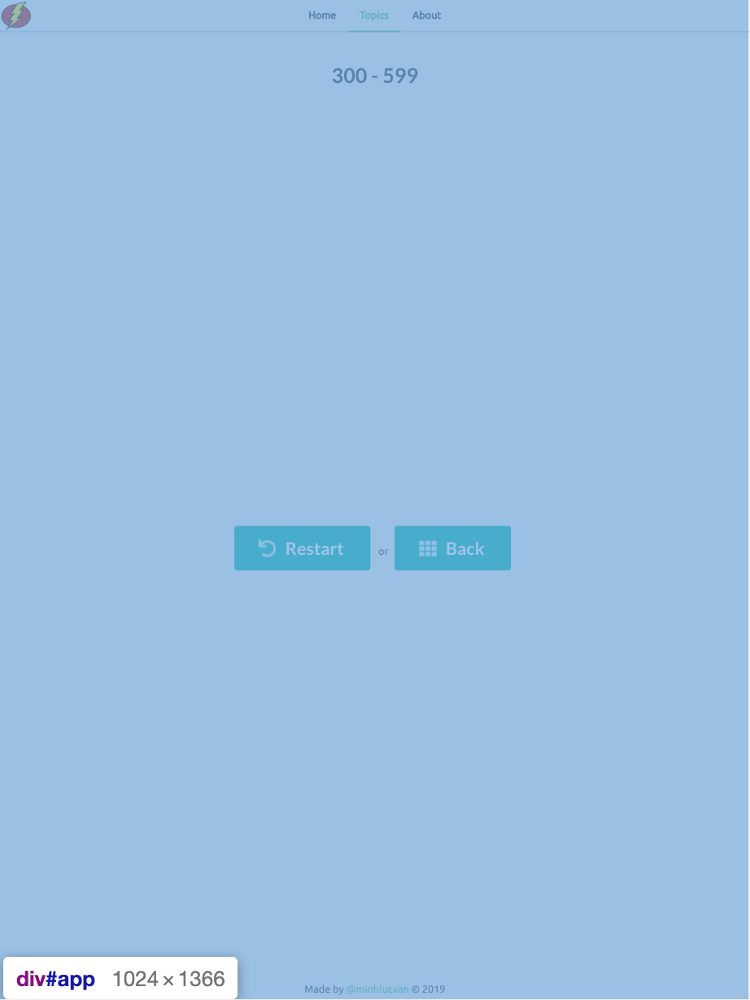
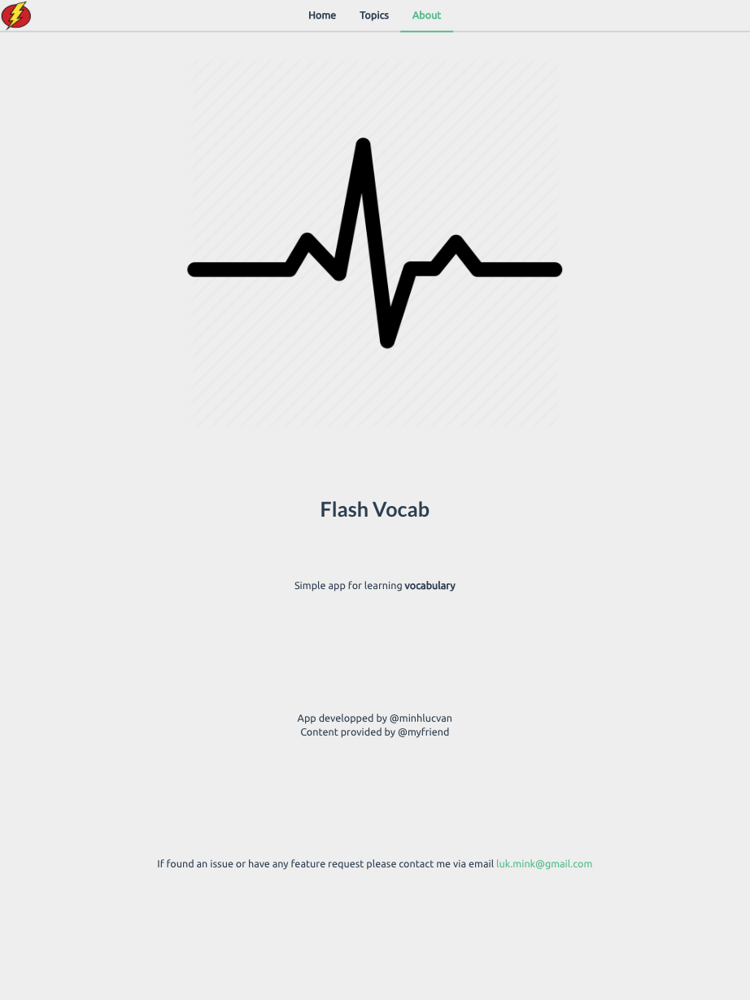

# flash-vocab

flash card PWA using vuejs

live demo: [https://flash-vocab-72773.firebaseapp.com](https://flash-vocab-72773.firebaseapp.com)

# Screenshots














## Project setup
```
npm install
```

### Compiles and hot-reloads for development
```
npm run serve
```

### Compiles and minifies for production
```
npm run build
```

### Run your tests
```
npm run test
```

### Lints and fixes files
```
npm run lint
```

### Customize configuration
See [Configuration Reference](https://cli.vuejs.org/config/).
# flash-vocab
